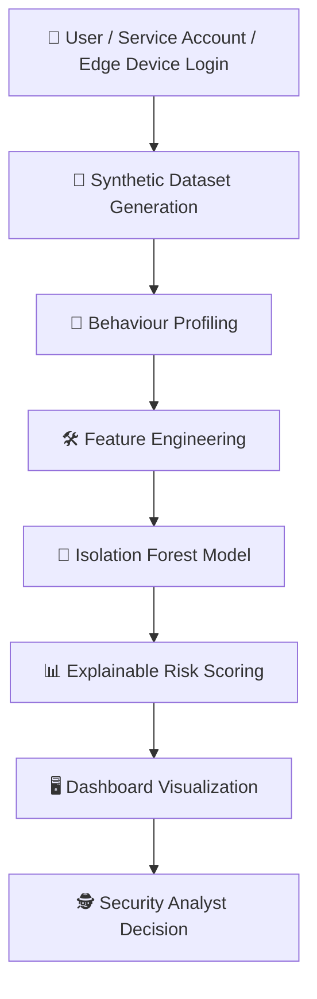
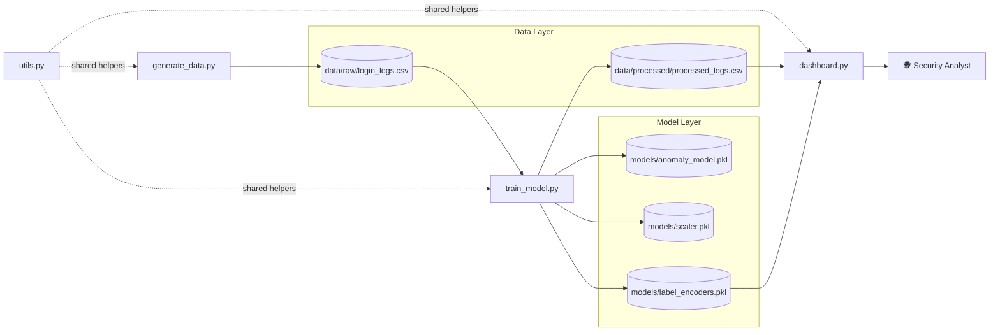
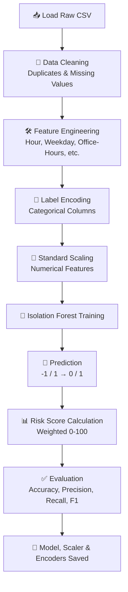

<div align="center">

# 🛡️ Honeywell SentinelAI

### AI-Powered Behavioral Anomaly Detection for Enterprise Cybersecurity

*A machine learning driven Security Operations Center (SOC) platform that learns how your enterprise normally behaves — and tells you the moment it doesn't.*

Built for the **Honeywell Hackathon** 🏆

[](https://www.python.org/)
[](https://streamlit.io/)
[](https://scikit-learn.org/)
[](https://plotly.com/)
[](https://pandas.pydata.org/)
[](#-license)
[](#)
[](#)

</div>

---

> [!NOTE]
> **SentinelAI** simulates a realistic enterprise authentication environment, trains an unsupervised anomaly detector on it, and presents the results through a live analyst-facing dashboard — end to end, from raw login events to actionable security insight.

## 📖 Table of Contents

1. [Project Overview](#-project-overview)
2. [Problem Statement](#-problem-statement)
3. [Solution Overview](#-solution-overview)
4. [Features](#-features)
5. [Architecture](#-architecture)
6. [Project Structure](#-project-structure)
7. [Technology Stack](#-technology-stack)
8. [Machine Learning Pipeline](#-machine-learning-pipeline)
9. [Dashboard Features](#-dashboard-features)
10. [Installation](#-installation)
11. [Usage](#-usage)
12. [Screenshots](#-screenshots)
13. [Future Improvements](#-future-improvements)
14. [Team](#-team)
15. [License](#-license)
16. [Acknowledgements](#-acknowledgements)
17. [Contact](#-contact)
18. [Conclusion](#-conclusion)

---

## 🎯 Project Overview

Every enterprise runs on identity. Employees, service accounts, and IoT/edge devices all authenticate constantly — into email, VPNs, databases, production servers, and industrial systems like SCADA and PLCs. That authentication traffic is one of the richest, earliest signals of compromise an organization has, yet most enterprises still monitor it with **static, rule-based thresholds** designed for a world of predictable 9-to-5 logins from a single office network.

**Honeywell SentinelAI** closes that gap. It treats every login as a *behavioral fingerprint* — who logged in, from where, at what hour, using which device, accessing which resource — and uses **machine learning** to learn what "normal" looks like for each individual entity, rather than applying one rigid rule to everyone.

Machine learning is the right tool here because attacker behavior is adaptive and threshold rules are brittle: a rule that flags "5+ failed logins" misses a slow, patient credential-stuffing campaign spread across hours, and a rule that flags "login outside 9–5" generates constant false positives for a legitimate on-call engineer. An **Isolation Forest** model, trained on dozens of behavioral dimensions simultaneously, isolates genuinely rare combinations of behavior — without anyone hand-writing a rule for every attack pattern in advance.

The result is a system that:

- 🧬 Builds a **behavioral baseline** for every user, service account, and edge device.
- 🌲 Uses **unsupervised anomaly detection** to flag deviations without needing labeled attack data in production.
- 🧠 Produces **explainable risk scores**, so analysts see *why* an event was flagged, not just *that* it was.
- 📊 Surfaces everything through a **SOC-style dashboard** built for real analyst workflows.

---

## 🚨 Problem Statement

Enterprise authentication is under constant, evolving attack. A handful of patterns account for the overwhelming majority of real-world identity compromise:

| Threat | Description |
|---|---|
| 🔑 **Credential Theft** | Stolen or phished credentials are reused to authenticate as a legitimate user. |
| 🕵️ **Insider Threat** | A legitimate, authorized user gradually misuses access — quietly expanding into resources outside their normal role. |
| ✈️ **Impossible Travel** | The same account authenticates from two geographically distant locations in a time window that would require physically impossible travel speed. |
| 💥 **Credential Stuffing** | Leaked username/password pairs from other breaches are tested en masse against enterprise logins. |
| 🔨 **Brute Force** | Repeated, rapid login attempts against a single account until one succeeds. |
| ↔️ **Lateral Movement** | A compromised account is used to pivot into systems and resources it has never legitimately accessed before. |

**Traditional rule-based detection struggles with all of them.** Static thresholds ("5 failed logins in 1 minute," "login outside business hours") are easy to evade with slow, randomized attacker behavior; blind to context (one rule applied equally to a night-shift SCADA operator and a 9-to-5 finance analyst); not adaptive to new attack patterns without manual rewrites; and not explainable at scale, producing binary alerts with no sense of severity and driving alert fatigue.

SentinelAI addresses this by learning behavior per-entity, scoring risk continuously instead of binary, and explaining every flagged event in plain language.

---

## 🧩 Solution Overview

SentinelAI's workflow takes a raw authentication event all the way to an analyst decision:



Each stage is handled by a dedicated module: **`generate_data.py`** simulates the enterprise, **`train_model.py`** learns from it and scores it, and **`dashboard.py`** puts the results in front of a human — with **`utils.py`** providing the shared plumbing underneath all three.

---

## ✨ Features

| Feature | Description |
|---|---|
| 🧪 **Synthetic Data Generator** | Produces ~10,000 realistic login events across users, service accounts, and edge devices, with 7 injected attack patterns. |
| 🧬 **Behaviour Profiling** | Every entity has its own baseline: normal hours, country, IP range, browser, OS, auth method, device fingerprint, and typical resources. |
| 🌲 **Isolation Forest Detection** | Unsupervised anomaly detection that requires no labeled attack data to generalize. |
| 📊 **Explainable Risk Scoring** | A transparent, weighted 0–100 risk score built from concrete behavioral signals, not a black box. |
| 🗣️ **Explainable AI** | Every anomaly comes with a plain-English explanation string (e.g. *"Off-hour login, Sensitive resource, Failed login"*). |
| 🖥️ **Interactive Dashboard** | A full Streamlit SOC dashboard with live filters across every dimension of the dataset. |
| 🕵️ **Threat Explorer** | A sortable, drill-down table of anomalies with full event detail on selection. |
| 📋 **Executive Summary** | Auto-generated, plain-language rollup of the current risk posture. |
| ⬇️ **Download Reports** | One-click CSV export of the full processed dataset or anomalies only. |

---

## 🏗️ Architecture

<details>
<summary><b>📦 Click to expand: what each module is responsible for</b></summary>

**`generate_data.py`** synthesizes the enterprise environment from scratch: builds behavioral profiles for users, service accounts, and edge devices (`UserProfile`), generates ~97% normal traffic (`EnterpriseDataGenerator`), and injects the 7 supported attack patterns (`AttackInjector`). Outputs `data/raw/login_logs.csv`.

**`train_model.py`** consumes the raw log, cleans it, engineers behavioral features (office-hours flags, cyclical hour encoding, resource frequency, device-change detection, etc.), label-encodes categorical fields, trains an `IsolationForest`, computes the weighted explainable risk score, and evaluates predictions against ground truth. Outputs `data/processed/processed_logs.csv` and the three files in `models/`.

**`utils.py`** is the shared toolbox used by all three scripts: logging setup, path/file helpers, model and CSV I/O with validation, risk-level bucketing, time formatting, dataframe validation, dataset statistics, Plotly theming, and number/duration formatting. Contains no business logic of its own.

**`dashboard.py`** is a **read-only** Streamlit application. It never retrains the model — it loads the processed dataset and saved artifacts, decodes the label-encoded columns back to human-readable values, and renders the full analyst-facing SOC dashboard with live filters.

</details>



---

## 📁 Project Structure

```
Honeywell-SentinelAI/
├── data/
│   ├── raw/               # Synthetic login_logs.csv generated by generate_data.py
│   └── processed/         # Cleaned, feature-engineered, scored dataset
│
├── models/                # Saved anomaly_model.pkl, scaler.pkl, label_encoders.pkl
│
├── src/
│   ├── generate_data.py   # Synthetic enterprise dataset generator
│   ├── train_model.py     # Feature engineering, training, risk scoring, evaluation
│   └── utils.py           # Shared reusable helper functions
│
├── dashboard.py            # Streamlit SOC dashboard (visualization only)
├── requirements.txt        # Python dependencies
├── README.md                # You are here
├── assets/                 # Screenshots, logos, and static images
└── reports/                # Exported CSV reports and analysis artifacts
```

| Folder / File | Purpose |
|---|---|
| `data/raw/` | Stores the untouched synthetic dataset straight out of the generator. |
| `data/processed/` | Stores the fully engineered, scored, analyst-ready dataset. |
| `models/` | Stores every trained artifact needed to reproduce or serve predictions without retraining. |
| `src/` | Houses the core pipeline scripts: generation, training, and shared utilities. |
| `dashboard.py` | The single entry point for the analyst-facing web application. |
| `assets/` | Static assets used in documentation, including `assets/screenshots/`. |
| `reports/` | Destination for exported CSVs and generated summaries. |

---

## 🛠️ Technology Stack

| Category | Technology |
|---|---|
| **Programming Language** | Python 3.10+ |
| **Core Libraries** | pandas, numpy, faker, joblib, ipaddress, pathlib, typing, collections |
| **Framework** | Streamlit (dashboard), scikit-learn (modeling) |
| **ML Model** | Isolation Forest (unsupervised anomaly detection) |
| **Visualization** | Plotly Express & Plotly Graph Objects |
| **Data Processing** | pandas, NumPy, StandardScaler, LabelEncoder |
| **Deployment** | Local execution via `streamlit run`; containerizable with Docker (see [Future Improvements](#-future-improvements)) |

---

## 🔬 Machine Learning Pipeline



| Stage | Detail |
|---|---|
| **Data Cleaning** | Drops duplicate rows; imputes missing numeric values with the median and missing categorical values with an explicit placeholder. |
| **Feature Engineering** | Derives `hour`, `day`, `weekday`, `month`, `is_office_hours`, `is_weekend`, `is_sensitive_resource`, `long_session`, `failed_login`, `new_device`, `resource_frequency`, cyclical `hour_sin`/`hour_cos`, and normalized session duration. |
| **Label Encoding** | Converts `entity_type`, `geo_location`, `resource_accessed`, `auth_method`, `command_sequence`, `browser`, `operating_system`, and `login_result` into numeric codes, storing every encoder for later decoding. |
| **Standard Scaling** | Normalizes all numeric features to zero mean / unit variance before training. |
| **Isolation Forest** | Trained with `n_estimators=200`, `contamination=0.03`, `random_state=42`, `n_jobs=-1`. |
| **Prediction** | Converts the model's native `-1`/`1` output into the project convention: `1 = anomaly`, `0 = normal`. |
| **Risk Score** | A transparent, weighted score combining off-hour login, weekend login, sensitive resource access, long session duration, failed login, and model-flagged anomaly — normalized to 0–100 with `Low` / `Medium` / `High` / `Critical` bands. |
| **Evaluation** | Reports accuracy, precision, recall, F1 score, confusion matrix, and full classification report against the ground-truth `label` column. |
| **Model Saving** | Persists `anomaly_model.pkl`, `scaler.pkl`, and `label_encoders.pkl` via `joblib`. |

---

## 🖥️ Dashboard Features

<details open>
<summary><b>📄 Pages</b></summary>

| Page | What it Shows |
|---|---|
| **Dashboard** | KPI cards, risk gauge, executive summary, login timeline, daily heatmap, attack/risk/entity distribution charts. |
| **Threat Analytics** | Geo distribution, top-10 riskiest entities, resource access treemap, OS/browser/auth-method breakdowns. |
| **Risk Explorer** | The Threat Explorer table (anomalies only, sorted by risk), full suspicious-event detail view, and CSV downloads. |
| **About** | A plain-language explanation of the project and its three-stage pipeline. |

</details>

<details>
<summary><b>📊 Charts & Widgets</b></summary>

| Element | Purpose |
|---|---|
| **KPI Cards** | Total events, normal events, anomalies, average risk score, and critical alerts at a glance. |
| **Login Timeline / Heatmap** | Line chart of normal vs. anomalous events over time, plus an hour-vs-weekday density heatmap. |
| **Risk Gauge** | A Plotly indicator gauge showing average risk score against Low/Medium/High/Critical bands. |
| **Pie Charts / Treemap** | Attack type, risk level (donut), OS, and browser distributions, plus a resource-access treemap. |
| **Bar Charts** | Geo distribution, authentication method, entity type, and top-10 risk users. |
| **Threat Table / Downloads** | A sortable table of anomalies with click-to-inspect detail, and one-click CSV export. |

</details>

Every chart and table **updates live** as sidebar filters (entity type, country, attack type, risk level, browser, OS, authentication method, and date range) are changed.

---

## ⚙️ Installation

> [!IMPORTANT]
> Requires **Python 3.10 or later**.

```bash
# Clone the repository
git clone https://github.com/<your-username>/Honeywell-SentinelAI.git
cd Honeywell-SentinelAI

# Create and activate a virtual environment
python -m venv venv
source venv/bin/activate      # Linux / macOS
venv\Scripts\activate         # Windows

# Install dependencies
pip install -r requirements.txt

# Generate the synthetic dataset
python src/generate_data.py

# Train the anomaly detection model
python src/train_model.py

# Launch the dashboard
streamlit run dashboard.py
```

---

## 🚀 Usage

**Generating data:** `python generate_data.py` creates `data/raw/login_logs.csv` with ~10,000 synthetic login events (~97% normal, ~3% attacks across 7 patterns). Re-run any time to regenerate a fresh dataset.

**Training the model:** `python train_model.py` reads the raw CSV, engineers features, trains the Isolation Forest, evaluates it against ground truth, and writes the processed dataset plus all three model artifacts. Must run at least once before the dashboard has anything to display.

**Launching the dashboard:** `streamlit run dashboard.py` opens the SOC dashboard in your browser, loading the processed dataset directly — it never retrains anything.

**Using filters:** the sidebar lets you narrow the dataset by entity type, country, attack type, risk level, browser, operating system, authentication method, and date range. Every chart, table, and KPI card updates immediately based on your selection.

**Interpreting alerts:** each anomaly is assigned a `risk_level` of `Low`, `Medium`, `High`, or `Critical`, along with a plain-English `explanation` (e.g. *"Off-hour login, Sensitive resource, Isolation Forest anomaly"*). Start triage with `Critical` alerts in the Threat Explorer, and use the Suspicious Event Detail panel to review the full context — IP, device, resource, and command sequence — before escalating.

---

## 🖼️ Screenshots

> [!TIP]
> All screenshots should be stored inside `assets/screenshots/` and referenced with relative paths, as below.

| View | Preview |
|---|---|
| **Dashboard (Overview)** |  |
| **Threat Analytics** |  |
| **Risk Explorer** |  |
| **Daily Heatmap** |  |
| **Threat Table** |  |
| **Executive Summary** |  |

---

## 🗺️ Future Improvements

- [ ] 🧠 Deep learning–based anomaly detection (LSTM / sequence models)
- [ ] 🔁 Autoencoders for reconstruction-error-based scoring
- [ ] 🕸️ Graph Neural Networks for entity-relationship-aware detection
- [ ] ⚡ Real-time streaming ingestion
- [ ] 📨 Kafka-based event pipeline
- [ ] 🔗 SIEM integration (Splunk)
- [ ] 🔗 Microsoft Sentinel integration
- [ ] ☁️ Cloud deployment
- [ ] 🐳 Docker containerization
- [ ] ☸️ Kubernetes orchestration
- [ ] 🔐 Role-based authentication for the dashboard
- [ ] 🌐 Live threat intelligence feed integration

---

## 👥 Team

| Role | Detail |
|---|---|
| **Developer** | *Raj Gaurav* |
| **Project** | Honeywell SentinelAI |
| **Hackathon** | Honeywell Hackathon |
| **Technologies Used** | Python, pandas, NumPy, scikit-learn, Streamlit, Plotly, Faker, joblib |
| **Contribution** | End-to-end design and implementation: synthetic data generation, feature engineering, anomaly detection model, explainable risk scoring, and the full SOC dashboard. |

---

## 📜 License

This project is licensed under the **MIT License** — see the [`LICENSE`](LICENSE) file for the full text.

> [!NOTE]
> Honeywell SentinelAI is intended for **educational, research, and hackathon purposes only**. The dataset is entirely synthetic, and the project is not certified or intended for production deployment as a standalone security control.

In short: you are free to use, copy, modify, merge, publish, distribute, and sublicense this software, provided the original copyright and permission notice are retained. It is provided **"as is," without warranty of any kind**.

---

## 🙏 Acknowledgements

- 🧡 **Honeywell**, for hosting the hackathon that inspired this project.
- 🌍 The **Open Source Community**, whose tools made this possible.
- 🐍 The **Python Community**, for an incredible ecosystem.
- 🌲 **Scikit-Learn**, for a robust, accessible machine learning toolkit.
- 🚀 **Streamlit**, for making interactive data apps trivial to build.
- 📈 **Plotly**, for beautiful, interactive visualizations.

---

## 📬 Contact

| Platform | Link |
|---|---|
| 💻 **GitHub** | [github.com/\<your-username\>](https://github.com/<your-username>) |
| 💼 **LinkedIn** | [linkedin.com/in/\<your-profile\>](https://linkedin.com/in/<your-profile>) |
| 📧 **Email** | \<your-email\>@example.com |

---

## 🏁 Conclusion

Honeywell SentinelAI demonstrates that meaningful behavioral anomaly detection doesn't require enormous infrastructure or labeled attack data — it requires a clear behavioral model, honest feature engineering, an unsupervised algorithm suited to the problem, and a presentation layer analysts can actually trust and act on. By combining synthetic enterprise simulation, an Isolation Forest anomaly detector, explainable risk scoring, and a live SOC dashboard, this project delivers a complete, end-to-end picture of what modern, ML-driven authentication security monitoring can look like — built in the spirit of hands-on experimentation that the Honeywell Hackathon set out to encourage.

<div align="center">

**⭐ If you found this project interesting, consider giving it a star! ⭐**

</div>